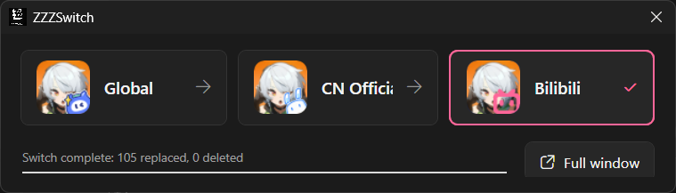

# ZZZSwitch

English | [简体中文](README.zh-CN.md)

ZZZSwitch is a Windows server switcher for **Zenless Zone Zero**, supporting **Global**, **CN Official**, and **Bilibili** clients.

Global ↔ CN Official switching uses the official Sophon manifests for the installed game version. ZZZSwitch reuses files already available in the current client, downloads only missing target files, and preserves the source-region differences before replacement so the reverse switch can reuse local data instead of downloading the original client again. Bilibili remains a CN-based channel overlay and uses a version-matched local package.

## Highlights

- Detects the game installation automatically or accepts a manually selected directory.
- Supports Chinese and English, light and dark themes, and a first-run setup guide.
- Provides a full window for status, package, cache, backup, and settings management.
- Provides a compact window with three server buttons, current-server highlighting, and inline switch progress.
- Runs in the system tray by default. A single left click restores the configured window; the right-click menu opens the full window, compact window, or exits.
- Lets you choose whether closing a window hides the application to the tray or exits it.
- Retrieves and browses Global/CN Sophon manifests for the exact installed game version.
- Reuses verified local files and completed version packages, including resumable file and chunk downloads.
- Preserves each server's hot-update cache automatically before switching.
- Supports custom cache and backup locations, old-version cache cleanup, startup behavior, and log retention.
- Uses MD5/SHA-256 verification, transactional backups, rollback journals, process checks, and path-safety validation.

## Requirements

- Windows x64.
- An installed PC version of Zenless Zone Zero.
- Internet access for Global ↔ CN Official manifests and any target files not already available locally.
- A version-matched legacy local package for any switch involving Bilibili. Bilibili resources are not obtained through Sophon.

## Usage

1. Download `ZZZSwitch-win-x64-v1.3.2.zip` from the [latest release](https://github.com/lz007001cn/ZZZSwitch/releases/latest), extract it to any folder, and run `ZZZSwitch.exe`.

2. On first launch, complete the setup guide:
   - choose Chinese or English and the interface theme;
   - detect or select the Zenless Zone Zero game directory;
   - choose the startup window and close behavior.

3. Completely close Zenless Zone Zero and HoYoPlay before switching.

4. Select the target server:
   - **Global ↔ CN Official:** ZZZSwitch checks both directions, reads the matching manifests when needed, preserves reusable source files, and downloads only missing target files.
   - **Bilibili:** ZZZSwitch uses the matching package under `.zzzswitch\packages\<game-version>` and shares CN Blocks resources while retaining a separate channel identity.

5. In the full window, review and confirm the switch summary. In the compact window, selecting a server starts the switch directly and reports progress in the lower-left corner without extra confirmation or completion dialogs.

6. ZZZSwitch backs up affected files and saves the source server's hot-update cache before applying changes. Verified downloads and chunks are retained after cancellation or network failure, so retrying does not restart from zero.

7. After switching, start the game and complete any target-server resource download. The first entry into another server may still require approximately **3–10 GB** of in-game resources.

8. Closing the application hides it in the system tray by default. Left-click the tray icon once to reopen the configured window, or use the right-click menu. Enable **Exit when closing a window** in Settings if preferred.

## Packages, Manifests, and caches

Open **Manage packages** to view saved versions, update or browse manifests, preview and verify completed packages, resume package updates, and remove selected local data.

Manifest metadata and automatic Global/CN packages are stored under `%LOCALAPPDATA%\ZZZSwitch`. Large server-specific Blocks caches remain separate and can be moved or cleaned through **Cache management**. Backup location, cache location, startup mode, close behavior, language, theme, and log retention are available in **Settings**.

Packages and caches are isolated by game installation and version. After a game update, ZZZSwitch creates new manifest, package, and cache records instead of applying older-version files. Previous-version caches can be cleaned independently, including read-only leftovers.

## Safety notes

> [!IMPORTANT]
> Do not switch while Zenless Zone Zero or HoYoPlay is running. Keep both closed until ZZZSwitch reports that the operation has completed.

- ZZZSwitch does not apply a package when the game version, file count, size, MD5, or SHA-256 validation fails.
- Global/CN online switching never falls back to an old `.zzzswitch\packages` replacement package.
- `Persistent\Blocks` is managed as a server cache; `Persistent\Video` is not moved, copied, verified, or deleted.
- File replacement, Blocks exchange, state updates, and backups participate in the same recoverable transaction.
- Startup recovery uses saved transaction journals and rollback backups after an interrupted operation.

## Developer documentation

- [Sophon Manifest retrieval, classification, download, and cross-region diff](docs/manifest-analysis.md)
- [Architecture and transaction design](docs/design.md)
- [Automated test coverage](docs/testing.md)
