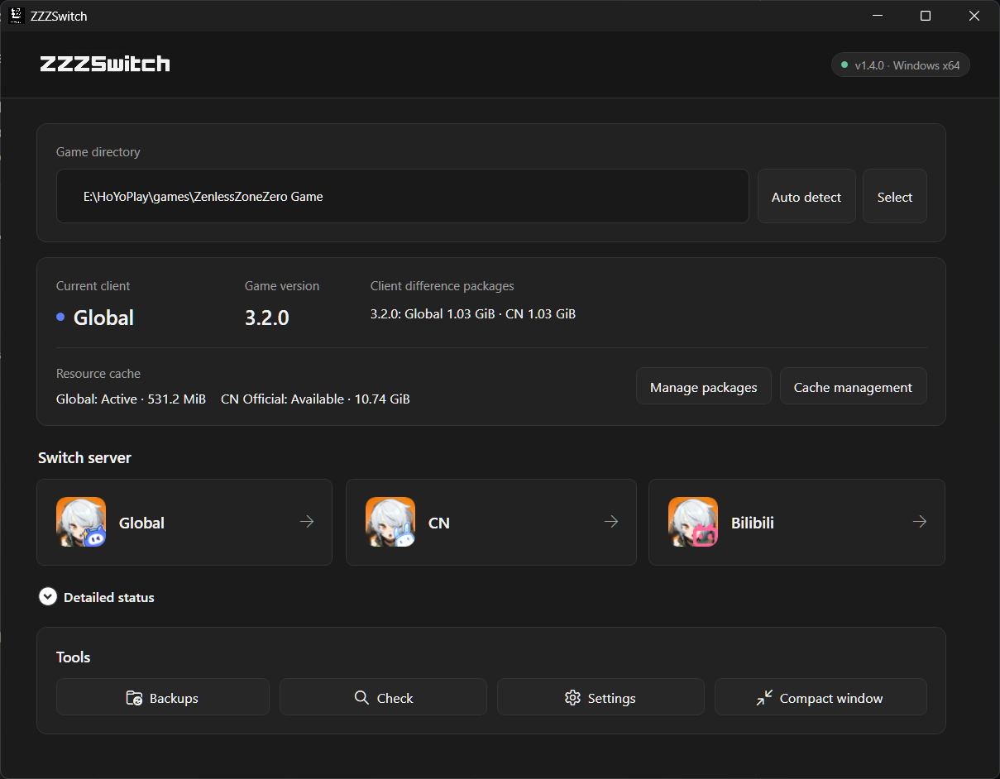

# ZZZSwitch

[English](README.md) | 简体中文

ZZZSwitch 是一款适用于 Windows 的《绝区零》服务器切换工具，支持**国际服、国服官服和 B服**客户端。

从 **v1.3.0** 开始，国际服与国服官服之间的切换不再依赖单独发布的本地替换包。ZZZSwitch 会按照当前游戏版本读取官方 Sophon Manifest，计算客户端差异，下载并校验真实文件，然后将结果保存为可重复使用的本地版本差异包。B服仍作为国服资源上的渠道登录组件叠加层，继续使用与游戏版本匹配的旧版本地差异包。

## 基础信息

- 支持 Windows x64 和《绝区零》PC 客户端。
- 首次切换国际服/国服时需要联网获取双方 Manifest；程序会按目标 Manifest 复用本地命中文件，并在覆盖前按来源 Manifest 保存当前服差异文件。来源文件完整时，反向切换可直接使用本地差异包，无需再次下载原客户端文件。
- 下载失败或取消后会保留已经验证的完整文件和分块，重试可以继续下载。
- B服不接入 Sophon Manifest。涉及 B服的切换需要在游戏目录的 `.zzzswitch\packages\<游戏版本>` 中准备匹配的旧版本地差异包。
- B服与国服官服共用 Blocks 资源缓存，但保留独立的客户端登录组件和备份身份。
- 当前服务器的热更新缓存会在切换前自动保存，不再需要手动“初始化当前服缓存”。
- 游戏升级后会按新版本重新获取 Manifest，并建立独立的差异包和缓存记录，不会套用旧版本文件。

## 使用说明

1. 从 [最新 Release](https://github.com/lz007001cn/ZZZSwitch/releases/latest) 下载 `ZZZSwitch-win-x64-v1.3.1.zip`，解压到任意目录后运行 `ZZZSwitch.exe`。

2. 让程序自动检测游戏目录，或手动选择《绝区零》安装目录。

3. 开始切换前，完全退出游戏和 HoYoPlay。

4. 选择目标服务器：

   - **国际服 ↔ 国服官服：**程序会查询目标方向和反向差异包；缺少任一方向时获取双方 Manifest，并在下载窗口中先校验、保存当前客户端可复用文件，再只下载目标方向缺失的文件。
   - **B服：**使用对应游戏版本的本地 B服差异包，不会出现在 Manifest 下载和浏览功能中。

5. 首次下载时确认文件数量和下载上限，然后开始下载。网络失败后点击重试即可继续，不必从零开始。

6. 查看切换摘要并确认。程序会先备份当前客户端状态、保存来源服热更新缓存，再执行文件替换。

7. 切换完成后启动游戏，并完成目标服务器可能要求的资源下载。首次进入新的服务器仍可能需要在游戏内下载约 **3–10 GB** 资源。

8. 再次切换前关闭游戏和启动器。程序会在下一次切换时自动保存当前服缓存，无需手动初始化。

如需查看或清理已下载内容，可从主页进入“差异包管理”；Manifest 更新、资源浏览、差异包预览、校验和更新均在该页面完成。大型 Blocks 缓存的位置和旧版本清理由“缓存管理”单独处理。

## 安全说明

> [!IMPORTANT]
> 游戏或 HoYoPlay 运行时不要执行切换。在 ZZZSwitch 明确提示操作完成前，请保持游戏和启动器关闭。

- 游戏版本、文件数量、大小、MD5 或 SHA-256 校验不通过时，程序不会应用差异包。
- 国际服/国服在线切换不会回退使用 `.zzzswitch\packages` 中的旧替换包。
- `Persistent\Blocks` 作为按服热更新缓存管理；`Persistent\Video` 不会被移动、复制、校验或删除。
- 普通文件替换、Blocks 交换、状态写入和外部备份处于同一套可恢复事务中。
- 操作意外中断后，程序会在下次启动时依据事务日志和回滚备份尝试恢复。
